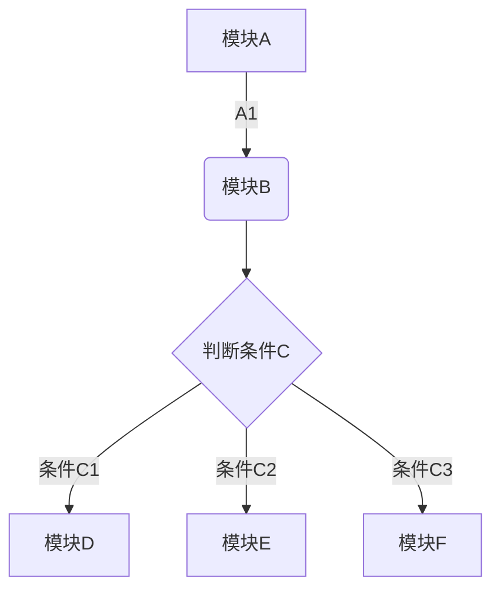

# 一级标题
## 二级标题
### 三级标题
...
###### 六级标题

**加粗**
*斜体*
***斜体加粗***
~~删除线~~

> 一层引用(>)
> > 二层引用(>>)
> > > 不停引用......

--- (分割线)

无序列表：
- 列表内容
+ 列表内容
* 列表内容

有序列表：
1. 列表内容
2. 列表内容
3. 列表内容

嵌套列表：
- 列表
   1. 列表（前三个空格）
   2. 列表
      1. 列表（前三个空格）
      2. 列表（前三个空格）

表格：
| 1 | 2 | 3 | 4 | 5 |
| --- | --- | --- | --- | --- |
| 1 | 2 | 3 | 4 | 5 |
| 1 | 2 | 3 | 4 | 5 |

|<noframes>这是什么？</noframes> 

---
第二行分割表头和内容。
- 有一个就行，为了对齐，多加了几个
文字默认居左
-两边加：表示文字居中
-右边加：表示文字居右
注：原生的语法两边都要用 | 包起来。此处省略
---

代码：
`代码内容`

```
    代码块
    代码块
    代码块
```

流程图：
